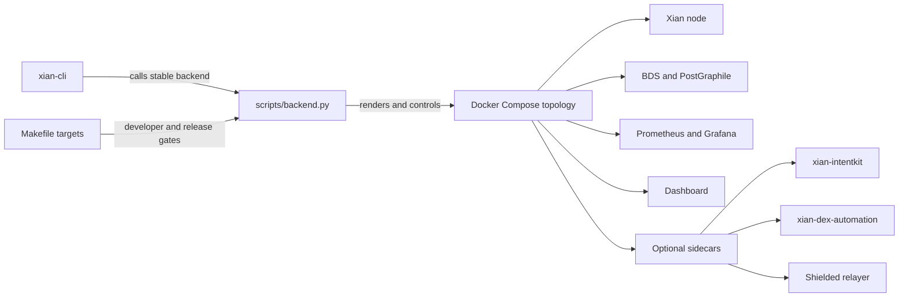

# xian-stack

`xian-stack` is the local runtime backend for Xian. It owns Docker images,
Compose topology, monitoring assets, localnet flows, and backend validation.
It is the implementation surface that sits behind the operator-facing
`xian-cli`, not a primary user-facing tool itself.

The stable machine-facing contract is `scripts/backend.py`. The `Makefile`
is the developer and debugging surface. `xian-cli` is the human-facing
control plane built on top of this backend.

## Runtime Shape



## Quick Start

Validate the stack:

```bash
python3 ./scripts/backend.py validate
make release-safety
```

Run the Python test suite:

```bash
python -m pip install -r requirements-test.txt
python -m pytest -q
```

Run a stack-managed local node:

```bash
python3 ./scripts/backend.py start  --no-bds-enabled --dashboard --monitoring
python3 ./scripts/backend.py status --no-bds-enabled --dashboard --monitoring
python3 ./scripts/backend.py endpoints --no-bds-enabled --dashboard --monitoring
python3 ./scripts/backend.py health --no-bds-enabled --dashboard --monitoring
python3 ./scripts/backend.py stop   --no-bds-enabled --dashboard --monitoring
```

The stack-managed single node configures periodic empty blocks by default
(`XIAN_BLOCK_POLICY_MODE=periodic`, `XIAN_BLOCK_POLICY_INTERVAL=5s`) so local
contract time stays close to wall-clock time during interactive development.
Set `XIAN_BLOCK_POLICY_MODE=on_demand` and `XIAN_BLOCK_POLICY_INTERVAL=0s`
before `make node-configure` only when stale time during idle periods is
acceptable.

The stack defaults to fail-closed host bindings:

- CometBFT RPC binds to `127.0.0.1` unless `--public-rpc` is set.
- CometBFT and app metrics bind to `127.0.0.1` unless `--public-metrics` is set.
- PostGraphile binds to `127.0.0.1` unless you run a BDS node and pass
  `--public-query` (read-only BDS surface; does not expose live RPC, mempool,
  or raw ABCI traffic).
- Local credentials are generated once into `.stack-secrets.env`, which is
  ignored by git.
- BDS uses a dedicated read-only PostgreSQL role for PostGraphile rather than
  the BDS owner account.

### Localnet

Initialize, start, and exercise a multi-node localnet:

```bash
python3 ./scripts/backend.py localnet-init  --nodes 4 --topology integrated --clean
python3 ./scripts/backend.py localnet-up    --wait-for-health --rpc-timeout-seconds 120
python3 ./scripts/backend.py localnet-workload --scenario counter_basic
```

Bootstrap the canonical DEX contracts on a running local node:

```bash
make localnet-up
make localnet-dex-bootstrap
# or against a specific RPC:
XIAN_DEX_BOOTSTRAP_RPC_URL=http://127.0.0.1:26657 make localnet-dex-bootstrap
```

Higher-level harnesses:

```bash
make localnet-protocol-safety        # 5-validator protocol safety harness
make localnet-e2e                    # layered 5-validator e2e harness
make localnet-parallel-e2e                 # same harness with lower parallel-execution batching
make localnet-vm-tps-bench           # tuned VM throughput sweep
make release-safety                  # full release-grade safety gate
```

### Optional Sidecars

Shielded relayer (proof-bound private-submission HTTP surface):

```bash
export XIAN_SHIELDED_RELAYER_PRIVATE_KEY=<relayer-ed25519-private-key>
python3 ./scripts/backend.py start --no-bds-enabled --shielded-relayer
```

Defaults to `127.0.0.1`. Binding to a non-loopback host requires
`XIAN_SHIELDED_RELAYER_AUTH_TOKEN`. When enabled, exposes Prometheus metrics
at `/metrics`. See `docs/` and the relayer environment variables in this
repo's history for the full policy surface
(`XIAN_SHIELDED_RELAYER_*`).

Deterministic DEX automation:

```bash
python3 ./scripts/backend.py start --no-bds-enabled --dex-automation
```

The default admin UI is `http://127.0.0.1:38280`. Config and service-wallet
key file are written under `.artifacts/dex-automation/`. Execution stays
disabled until `wallet.execute=true` in the config. Binding the admin UI to
a non-loopback host requires the same explicit `--public-query` opt-in.

### Releases

Plan or apply a coordinated workspace release:

```bash
python3 ./scripts/release_orchestrator.py plan
python3 ./scripts/release_orchestrator.py apply
```

Release images are built from digest-pinned base images and checksum-pinned
external inputs, signed by digest, and accompanied by signed release assets.
See `docs/RELEASES.md` for verification commands.

## Runtime Recipes

`xian-stack` has two surfaces by design:

- `scripts/backend.py` is the stable machine contract used by `xian-cli`, CI,
  and automation.
- `make ...` targets are the developer and release-engineering surface for
  image builds, localnet harnesses, and deep validation.

Use the smallest recipe that proves the behavior you care about:

| Need | Command | What it proves |
| --- | --- | --- |
| Single local node with optional services | `python3 ./scripts/backend.py start ...` | Compose wiring, node health, dashboard / monitoring / BDS sidecars |
| Clean multi-node topology | `LOCALNET_NODES=5 make localnet-init && make localnet-up` | Validator topology, genesis distribution, peer connectivity |
| Workload smoke on a running localnet | `make localnet-workload` | Basic contract submission and transaction flow |
| Full 5-validator e2e harness | `make localnet-e2e` | Layered cross-repo behavior, workload phases, DEX coverage, catchup, governance, chaos / restart convergence |
| IntentKit x402 buyer phase | `LOCALNET_E2E_INTENTKIT_X402=1 make localnet-e2e` | Adds a live IntentKit Xian-native x402 payment through a local seller/facilitator |
| Parallel 5-validator harness | `make localnet-parallel-e2e` | The same e2e program with lower parallel-execution batching |
| Protocol safety harness | `make localnet-protocol-safety` | Validator set, delegation, evidence, governance, and state-patch behavior |
| Release gate | `make release-safety` | Repo validation plus the release-grade localnet gates |

The localnet harnesses are intentionally heavier than a clean topology. A
clean five-node network tells you that the validators can start and peer. The
e2e harness tells you that the product stack still behaves under realistic
contract, indexer, governance, recovery, and restart pressure.

For automation, prefer the backend command equivalents where available:

```bash
python3 ./scripts/backend.py validate
python3 ./scripts/backend.py localnet-init --nodes 5 --topology integrated --clean
python3 ./scripts/backend.py localnet-up --wait-for-health
python3 ./scripts/backend.py localnet-e2e
```

## Principles

- **Runtime plumbing, not operator UX.** Images, Compose topology, smoke
  flows, and localnet harnesses live here. User-facing lifecycle commands
  live in `xian-cli`.
- **`scripts/backend.py` is the stable machine contract.** External callers
  (CLI, CI, automation) target it. The `Makefile` is for developers and
  debugging.
- **Optional layers stay optional.** Monitoring, dashboard, BDS, shielded
  relayer, DEX automation, and IntentKit are easy to enable without becoming
  required to understand the core node.
- **Fail-closed network bindings.** Loopback by default; public exposure is
  always an explicit opt-in flag.
- **Localnet flows are product safety nets.** They double as smoke gates for
  cross-repo behavior, not just developer convenience.
- **Independent sibling repos stay independent.** `xian-intentkit` and
  `xian-dex-automation` are attached as optional services without copying
  their topology into this repo.

## Key Directories

- `docker/` — runtime image build definitions for the node and BDS layers.
- `docker-compose-*.yml` — Compose topology files (`abci`, `abci-bds`,
  `abci-dev`, `contracting`, `intentkit`, `localnet`, `monitoring`).
- `scripts/` — backend control plane (`backend.py`), release orchestrator,
  smoke flows, localnet tooling, and TPS benchmarks.
- `monitoring/` — Prometheus, Grafana dashboards (including dedicated
  `Xian VM Runtime` and `Xian BDS Recovery`), and alert variants.
- `workloads/` — localnet workload fixtures and contracts.
- `contracts/` — built-in contract bundles deployed by localnet bootstrap.
- `tests/` — backend, smoke, and harness coverage.
- `docs/` — runtime, release, and governance notes.

## Backend Surface

The stable interface exposed by `scripts/backend.py` covers:

- `validate`
- `start`, `stop`, `status`
- `endpoints`, `health`
- `bds-snapshot-export`, `bds-snapshot-import`
- `smoke`, `smoke-cli`
- `localnet-*` flows
- `localnet-dex-bootstrap` for opt-in canonical DEX deployment
- `localnet-node-report` for fixed VM node capability checks

Use the `Makefile` for lower-level debugging, image builds, and developer
shell access. Use `xian-cli` for human-facing operator workflows.

## Capabilities

- build and run the local Xian runtime in `integrated` or `fidelity` topology
- run canonical-network nodes from pinned published `xian-node` release
  images, with source builds available as a local override
- expose a stable machine-facing backend command surface
  (`scripts/backend.py`)
- start optional dashboard, BDS, Prometheus, and Grafana layers
- start an optional stack-managed DEX automation service for deterministic,
  rule-based DEX actions
- start an optional stack-managed shielded relayer for proof-bound private
  submission
- attach a stack-managed `xian-intentkit` deployment while keeping its repo
  and Compose files independent
- run smoke checks and CLI-driven smoke flows
- initialize multi-node localnets and drive workload scenarios against them
- ship monitoring dashboards and alert rules that match validated operator
  profiles

## Validation

```bash
make validate
make smoke
make smoke-cli
```

`make smoke` is the main repo safety net. `make smoke-cli` is the cross-repo
operator-flow gate. `make release-safety` runs the full release-grade gate
before tagging this repo.

## Related Docs

- [AGENTS.md](AGENTS.md) — repo-specific guidance for AI agents and contributors
- [docs/README.md](docs/README.md) — index of internal docs
- [docs/ARCHITECTURE.md](docs/ARCHITECTURE.md) — major components and dependency direction
- [docs/BACKLOG.md](docs/BACKLOG.md) — open work and follow-ups
- [docs/RELEASES.md](docs/RELEASES.md) — release process, signing, and reproducibility checks
- [docs/RUNTIME_LIMITS.md](docs/RUNTIME_LIMITS.md) — runtime resource limits and policy
- [docs/RUNTIME_RELEASE_BACKLOG.md](docs/RUNTIME_RELEASE_BACKLOG.md) — runtime release follow-ups
- [docs/LOCALNET_PROTOCOL_SAFETY.md](docs/LOCALNET_PROTOCOL_SAFETY.md) — 5-validator protocol safety harness
- [docs/LOCALNET_WORKLOAD_BACKLOG.md](docs/LOCALNET_WORKLOAD_BACKLOG.md) — localnet workload follow-ups
