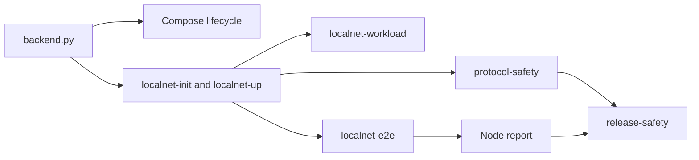

# Scripts

## Purpose

This folder contains the stable backend control surface and the local runtime
tooling behind `xian-stack`.

## Key Files

- `backend.py`: the main machine-facing backend command surface
- `dex_automation_backend.py`: stack adapter for the optional
  `xian-dex-automation` Python sidecar, including generated config, service
  wallet key file, process lifecycle, and health probing
- `stack-env.sh`: shared environment/bootstrap shell helper for Compose flows
- `release-safety.sh`: cross-repo release gate that runs repo validation plus
  the native-VM and governance localnet safety paths
- `smoke-stack.sh` and `smoke-cli.sh`: repo-level smoke entrypoints
- `localnet-init.py`: multi-node localnet creation, including local-only
  validator keys, bundle-backed genesis selection, fixed VM execution, and
  optional BDS wiring
- `localnet-dex-bootstrap.py`: opt-in local DEX deployment harness for a
  running local node or generated localnet; it deploys `con_pairs`, `con_dex`,
  optional `con_dex_helper`, and a reusable local demo pool for DEX UI and
  event testing
- `localnet-workload.py`: deterministic workload execution against the localnet
- `localnet-tps-bench.py`: repeatable throughput sweeps for a running localnet;
  it writes benchmark artifacts under `.artifacts/tps-bench/` and reports both
  committed chain throughput and end-to-end client workload throughput
- `localnet-e2e.py`: the layered 5-validator testnet-shaped end-to-end program
  that exercises the live stack phase by phase, including direct and
  permit-authorized `currency.approvals` flows, live contract rollback probes,
  native transfer fan-out, VM-heavy contract workloads,
  restart-and-convergence chaos coverage, timed soak/abuse coverage, an opt-in
  IntentKit Xian-native x402 buyer phase via `--intentkit-x402`, and writes
  artifacts under
  `.artifacts/localnet-e2e/<run-id>/`
- `localnet_node_report.py`: collects fixed VM capability status from a running
  localnet and emits a node report as JSON;
  it reads the Xian app metrics exporter, not the CometBFT metrics endpoint
- `make localnet-parallel-e2e`: wrapper around `localnet-e2e.py` that boots the same
  5-validator integrated stack with lower parallel-execution batching; it also
  enforces the node report through the generated `node_report.json`
  artifact
- `localnet-protocol-safety.py`: focused protocol safety exercise against a
  real 5-validator testnet-shaped localnet, including validator/delegation
  flows, real duplicate-vote evidence injection, governance state-patch
  activation, and announce-leave coverage, with JSON artifacts under
  `.artifacts/localnet-protocol-safety/<run-id>/`
- `localnet-workload.py`, `localnet-memwatch.py`,
  `localnet-leak-hunt.py`, `localnet-perf-summary.py`: deeper runtime
  investigation helpers
- `release_manifest.py` and `trusted_publishers.py`: release and publisher
  support helpers
- `release_orchestrator.py`: local multi-repo release planner and tag pusher for
  the full Xian workspace

## Notes

- Prefer stable script entrypoints over ad hoc shell fragments in CI or
  operator docs.
- `backend.py` is the contract to build on if another repo or tool wants to
  drive the local stack programmatically.
- `dex_automation_backend.py` expects the sibling `xian-dex-automation` repo
  by default. Override `XIAN_DEX_AUTOMATION_DIR`,
  `XIAN_DEX_AUTOMATION_CONFIG`, or
  `XIAN_DEX_AUTOMATION_PRIVATE_KEY_FILE` for non-standard layouts.
- `network.json` under `.localnet/` includes local-only validator private keys
  for automated governance flows. Treat it as disposable dev material and do
  not reuse it outside the local test network.
- `localnet-dex-bootstrap.py` is a post-start local harness, not a genesis
  mutation and not product packaging. The base contract bundle remains
  unchanged; local DEX availability is an explicit operator action. Product
  entrypoints live in `xian-dex`, and this stack script remains available for
  release/e2e validation and low-level local debugging.
- The protocol safety runner should be executed through `uv` with the
  `xian-abci` project and local `xian-py` package available, preferably through
  `make localnet-protocol-safety`.
- `make localnet-node-report` is the quick operator/debugging path for
  checking whether all localnet nodes report the fixed Xian VM capability.
- `make localnet-vm-tps-bench` is the benchmark wrapper for a tuned 5-node
  native-VM localnet. Prefer `committed_workload_tps` over client-side
  `workload_tps` when reporting chain throughput.
- `./scripts/release-safety.sh` and `make release-safety` are the release-grade
  stack entrypoints. They validate sibling repos, run the localnet e2e harness,
  enforce the node report, and run the protocol safety localnet.

