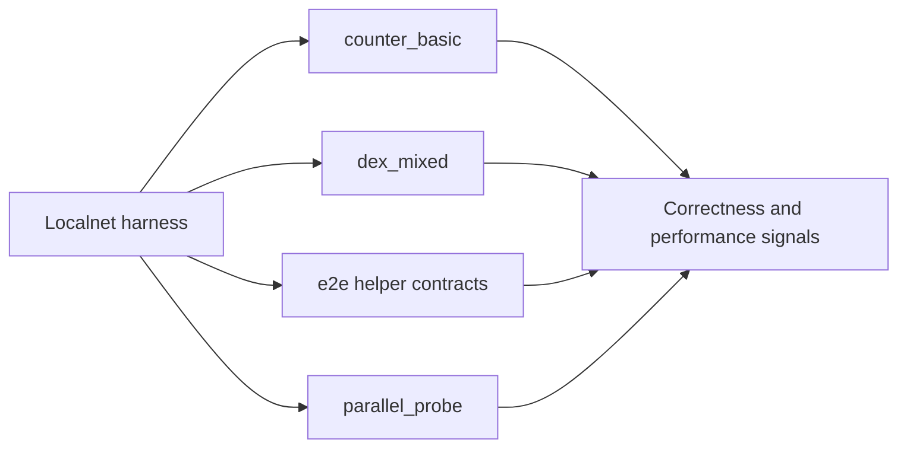

# Workloads

## Purpose
- This folder contains localnet workload scenarios used for correctness and performance testing.

## Contents
- `counter_basic/`: simple baseline workload
- `dex_mixed/`: richer mixed contract workload
- `e2e/`: small deterministic helper contracts used by the full localnet
  end-to-end runner
- `parallel_probe/`: deterministic contract used by the 5-validator localnet
  run to force conflict-free, same-sender, read-after-write, and prefix-scan
  parallel-execution paths

## Notes
- Keep workloads deterministic and self-contained so they can harden the stack over time.
- The `e2e/` helper contracts are intentionally minimal and exist to exercise
  conflict handling and governed state patching without introducing unrelated
  business logic.

