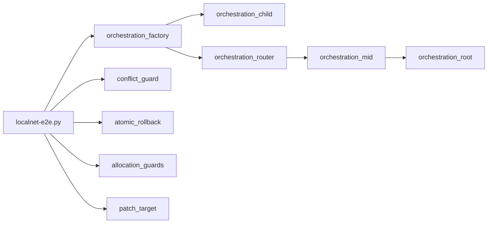

# E2E Workloads

This folder contains small, deterministic helper contracts used by the
multi-phase localnet end-to-end runner.

- `conflict_guard.py`: deterministic conflict and failure surface
- `atomic_rollback.py`: live rollback probe for failed contract writes and
  failed cross-contract token transfers
- `allocation_guards.py`: allocation limit probes for the VM runtime
- `orchestration_factory.py`: deploys multiple child contracts from a contract
  using templated artifact bundles rendered by `localnet-e2e.py`
- `orchestration_child.py`: canonical child contract source for the
  orchestration deployment flow
- `orchestration_router.py`: dynamic contract and function dispatch helper
- `orchestration_mid.py`: mid-hop contract for caller/signer chain checks
- `orchestration_root.py`: root-hop contract for nested ctx semantics
- `patch_target.py`: simple state-patch target contract

